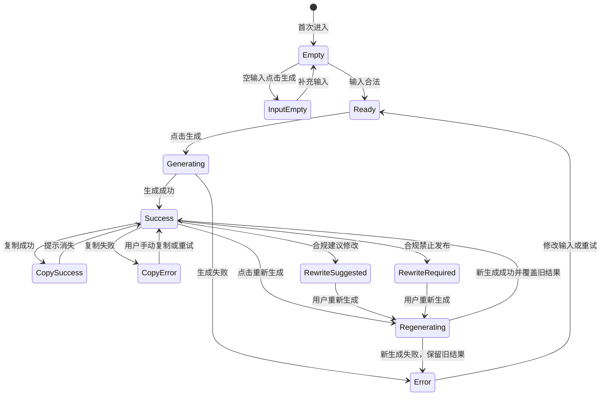

# 03_UIUX_Wireframe_Spec.md

> 文档名称：发朋友圈数字员工低保真原型说明文档与前端实现标注  
> 任务编号：UIUX-SPEC-02  
> 功能名称：发朋友圈数字员工 / 朋友圈转发助手  
> 文档角色：UI/UX 设计师  
> 原型文件：`docs/features/moments/03_UIUX_Wireframe.html`  
> 当前阶段：前端实现前 UIUX 深化说明  

---

## 1. 文档目的

本文档是 `03_UIUX.md` 的补充说明，用于把低保真原型 `03_UIUX_Wireframe.html` 转换为前端可实现、QA 可测试、产品可评审的执行说明。

与上游文件的关系如下：

| 文件 | 本文档使用方式 |
|---|---|
| `03_UIUX.md` | 作为页面结构、交互状态、移动端规则的主要依据 |
| `03_UIUX_Wireframe.html` | 作为低保真页面布局和状态说明的可视化附件 |
| `05_Tech_Design.md` | 作为 API 字段、响应结构、状态编码和前后端边界依据 |
| `06_Tasks.md` | 作为前端、后端、AI、QA 开发任务拆解依据 |

本文档的使用对象：

| 角色 | 使用目的 |
|---|---|
| 前端工程师 | 按区域、组件、状态、API 映射实现页面 |
| QA 测试工程师 | 将状态、交互和异常规则转化为测试用例 |
| 产品负责人 | 确认原型是否符合 MVP 范围和用户路径 |
| 架构师 / 全栈工程师 | 确认前端状态、API 响应、错误处理与技术方案一致 |

---

## 2. 页面总览

该页面的核心目标是帮助跨境支付渠道商、区域 BD、市场专员快速生成可复制、专业、合规的朋友圈文案草稿。

页面目标：

- 帮助用户输入朋友圈内容生成条件。
- 调用后端生成朋友圈草稿。
- 展示生成结果。
- 支持复制文案。
- 支持重新生成。
- 展示基础合规提示。

页面类型：移动端优先页面。  
参考宽度：390px。  
布局方式：单页纵向滚动，核心路径为输入条件 → 生成内容 → 查看结果 → 复制正文 / 重新生成 / 反馈。

---

## 3. 页面结构拆解

| 区域 | 区域目的 | 包含元素 | 是否必需 | 前端实现建议 | QA 检查点 |
|---|---|---|---|---|---|
| 顶部标题区 | 让用户确认当前功能位置，并提供返回入口 | 返回入口、页面标题“发朋友圈数字员工” | 是 | 固定在页面顶部或自然流顶部；移动端保持高度不低于 56px | 标题正确；返回入口存在；不遮挡内容 |
| 功能说明区 | 说明页面用于生成朋友圈文案草稿 | 简短说明、空状态提示 | 是 | 可作为结果区空状态或顶部说明，不使用营销化长文 | 首次进入时用户能理解页面用途 |
| 输入表单区 | 收集生成条件 | 内容类型、目标客户、产品卖点、文案风格、补充说明 | 是 | 单列排列；字段标签与控件紧邻；补充说明显示字数 | 字段完整；选项与 PRD 一致；移动端可点击 |
| 生成按钮区 | 触发生成请求 | 主按钮“生成朋友圈内容” | 是 | 位于输入区下方，移动端宽度占满内容区，最小高度 44px | 不同状态下按钮可用性符合规则 |
| 状态提示区 | 展示加载、错误、复制等即时反馈 | 空状态、字段错误、生成中、失败提示、Toast | 是 | 状态提示靠近触发位置；字段错误在字段下方 | 每个状态都有可见提示 |
| 结果展示区 | 展示生成内容主体 | 标题 / 首句、朋友圈正文 | 是 | 正文作为主卡片；明确正文是默认复制内容 | 正文醒目；标题不默认复制 |
| 合规提示区 | 展示辅助判断信息 | 转发建议、合规提示、改写建议 | 是 | 放在正文下方，明确不是默认复制内容 | 风险提示可见，不被按钮遮挡 |
| 操作按钮区 | 提供结果后操作 | 复制文案、重新生成、有用、没用 | 是 | 复制和重新生成靠近正文；反馈按钮靠近结果底部 | 无结果时按钮隐藏或禁用；成功后可操作 |
| 底部说明区 | 说明本期边界和低保真状态 | 本期不做说明、状态说明 | 是 | 只做说明文字，不做可点击入口 | 不出现超出 MVP 的操作入口 |

---

## 4. 表单字段说明

| 字段名称 | 字段 key | 控件类型 | 是否必填 | 可选值 | 默认值 | 校验规则 | 错误提示文案 | API 请求字段映射 |
|---|---|---|---|---|---|---|---|---|
| 内容类型 | `contentType` | Select | 是 | 产品解读、热点借势、客户案例 | 未选择 | 不能为空，必须来自预设选项 | 请选择内容类型 | `content_type`：`product_explain` / `trend_jacking` / `customer_case` |
| 目标客户 | `targetCustomer` | Select | 是 | Amazon 卖家、Shopee 卖家、外贸 B2B | 未选择 | 不能为空，必须来自预设选项 | 请选择目标客户 | `target_customer`：`amazon_seller` / `shopee_seller` / `b2b_exporter` |
| 产品卖点 | `productPoints` | Checkbox / 多选 | 是 | 到账快、费率透明、合规安全 | 空 | 至少选择 1 项，最多选择 3 项 | 请至少选择 1 个产品卖点 | `product_points`：`fast_settlement` / `transparent_fee` / `compliance_safe` |
| 文案风格 | `copyStyle` | Radio / Segmented control | 是 | 专业、轻松、销售感强 | 专业 | 不能为空，必须来自预设选项 | 请选择文案风格 | `copy_style`：`professional` / `casual` / `sales_driven` |
| 补充说明 | `extraContext` | Textarea | 否 | 用户自由输入 | 空字符串 | 自动去除前后空格；最多 300 字 | 补充说明最多 300 字 | `extra_context` |

前端实现补充：

- 必填字段为空时，允许点击生成按钮，但点击后必须显示字段错误。
- 补充说明超过 300 字时，生成按钮禁用，并在输入框下方展示字数错误。
- 前端校验不能替代后端校验；后端仍需返回统一错误码。

---

## 5. 结果字段说明

| 字段名称 | API 字段路径 | 展示位置 | 空值处理 | 是否允许复制 | QA 检查点 |
|---|---|---|---|---|---|
| 标题 / 首句 | `result.title` | 结果展示区顶部 | 空值时展示“未生成标题”，并标记结果不完整 | 否 | 成功响应时标题可见；复制正文时不包含标题 |
| 朋友圈正文 | `result.body` | 结果展示区主卡片 | 空值时展示失败提示或兜底模板，不允许当作成功结果 | 是，仅默认复制该字段 | 正文明确标注为默认复制主内容；复制按钮只复制正文 |
| 转发建议 | `result.forwarding_advice` | 合规提示区 / 辅助信息区 | 空值时展示“暂无转发建议” | 否 | 不被复制按钮复制 |
| 合规状态 | `result.compliance_tip.status` | 合规提示卡片状态标签 | 空值时按 `rewrite_suggested` 展示 | 否 | `publishable`、`rewrite_suggested`、`rewrite_required` 样式和文案区分 |
| 合规风险等级 | UI 派生字段：由 `result.compliance_tip.status` 映射 | 合规提示卡片 | 无法映射时展示“待确认” | 否 | `publishable` 可映射为低风险；`rewrite_suggested` 为中风险；`rewrite_required` 为高风险 |
| 合规风险项 | `result.compliance_tip.risk_types` | 合规提示卡片风险列表 | 空数组时展示“未发现明显风险” | 否 | 命中风险时逐项展示，不隐藏 |
| 合规建议 | `result.compliance_tip.message` | 合规提示卡片说明 | 空值时展示“请人工确认后发布” | 否 | 文案克制，不做绝对化承诺 |
| 改写建议 | `result.rewrite_suggestion` | 改写建议卡片 | 空值或“无”时展示“无” | 否 | 风险状态下必须可见；无风险时不干扰主流程 |
| 是否兜底 | `fallback_used` | 结果区或合规提示区标记 | false 时不展示 | 否 | true 时必须显示“需要人工补充”，避免误认为可直接发布 |
| 生成状态 | `status` | 状态提示区 | 无状态时回到初始空状态 | 否 | `success`、`error`、`output_incomplete`、`quality_failed` 可被前端识别 |

字段说明：

- 技术方案当前 API 使用 `result.compliance_tip`，而非独立的 `compliance` 对象。
- 本文档中的“合规风险等级”是 UI 派生展示字段，不要求后端新增字段。
- “改写建议”在 UI 中可命名为“改写建议”，API 字段保持 `result.rewrite_suggestion`。

---

## 6. 页面状态说明

| 状态 | 触发条件 | 页面展示 | 按钮状态 | 用户可执行动作 | 前端状态变量建议 | QA 验收标准 |
|---|---|---|---|---|---|---|
| 初始空状态 | 首次进入页面 | 输入区可编辑，结果区展示空状态说明 | 生成按钮可点击；复制 / 重新生成隐藏或禁用 | 填写表单 | `uiState = "empty"` | 首屏能看到输入区和用途说明 |
| 输入为空 | 点击生成但必填项为空 | 对应字段高亮，字段下方展示错误 | 生成按钮恢复可点击 | 补充缺失字段 | `uiState = "input_empty"`；`fieldErrors` | 每个缺失字段能显示明确错误 |
| 输入合法但未生成 | 表单填写合法，但用户尚未点击生成 | 结果区仍为空状态，可提示“填写完成后点击生成” | 生成按钮可点击 | 点击生成 | `uiState = "ready"` | 合法输入不显示错误 |
| 生成中 | 校验通过后调用接口 | 按钮 Loading，输入区禁用或防止重复提交，结果区显示生成中 | 生成按钮禁用；复制 / 重新生成禁用 | 等待接口返回 | `uiState = "generating"` | 不允许重复点击触发多次请求 |
| 生成成功 | API 返回 `success = true` 且 `status = success` | 展示标题、正文、转发建议、合规提示、改写建议 | 复制、重新生成、有用、没用可点击 | 复制、重新生成、反馈 | `uiState = "success"`；`currentResult` | 五类输出完整可见 |
| 生成失败 | API 返回 `status = error` 或网络异常 | 展示失败提示；若有兜底模板，标记“需要人工补充” | 生成按钮恢复可点击；复制视兜底策略禁用或允许手动复制 | 修改输入后重试 | `uiState = "error"`；`errorMessage` | 用户知道失败原因和下一步 |
| 复制成功 | 用户点击复制文案且浏览器复制成功 | Toast 或短提示“已复制” | 复制按钮保持可点击 | 继续操作 | `copyState = "success"` | 复制内容只包含正文 |
| 复制失败 | 浏览器复制失败或权限受限 | Toast “复制失败，请手动复制正文” | 复制按钮可再次点击 | 手动选择正文复制 | `copyState = "error"` | 提示清楚，不丢失正文 |
| 重新生成中 | 成功结果存在后点击重新生成 | 旧结果保留，显示“正在生成新版本” | 重新生成按钮禁用；复制旧正文可保留或禁用，需产品确认 | 等待新结果 | `uiState = "regenerating"`；`previousResult` | 新结果返回前旧结果不被清空 |
| 超长输入 | 补充说明超过 300 字 | 输入框下方显示字数错误 | 生成按钮禁用 | 删除或缩短输入 | `uiState = "input_too_long"`；`fieldErrors.extraContext` | 超长时不能发起 API 请求 |
| 合规建议修改 | API 返回 `result.compliance_tip.status = rewrite_suggested` 或 `status = quality_failed` 且风险可改写 | 合规提示高亮“建议修改”，展示改写建议 | 复制按钮可用，但需保留风险提示 | 人工修改、复制或重新生成 | `complianceState = "rewrite_suggested"` | 用户复制前能看到风险提示 |
| 合规禁止发布 | API 返回 `result.compliance_tip.status = rewrite_required` | 合规提示高亮“发布前必须修改”，展示风险项和改写建议 | 复制按钮可用性待产品确认；建议保留但强化提示 | 人工修改、重新生成 | `complianceState = "rewrite_required"` | 风险提示不能被隐藏，兜底模板不能误认为最终可发布 |

---

## 7. 状态流转图

---

## 8. 交互规则

| 交互 | 用户动作 | 前端判断 | 调用 API 与否 | 页面反馈 | 失败兜底 |
|---|---|---|---|---|---|
| 点击生成按钮 | 用户点击“生成朋友圈内容” | 检查必填、枚举、产品卖点数量、补充说明长度 | 合法时调用 `POST /api/moments/generate` | 进入生成中状态 | API 失败时展示失败提示或兜底模板 |
| 表单为空时点击生成 | 未填写必填项直接点击生成 | 标记缺失字段 | 否 | 字段高亮，展示错误提示 | 用户补齐后可重新点击 |
| 补充说明超长 | 输入超过 300 字 | 实时判断长度 | 否 | 字数错误，生成按钮禁用 | 删除到 300 字以内恢复 |
| 生成过程中再次点击按钮 | 用户重复点击生成按钮 | `uiState` 为 generating 或 regenerating | 否 | 按钮保持禁用 + Loading | 防止重复请求 |
| 生成成功后复制文案 | 用户点击“复制文案” | 检查 `result.body` 是否存在 | 否 | 成功时提示“已复制” | 复制失败时提示手动复制 |
| 复制失败时提示 | 浏览器权限、环境限制导致复制失败 | 捕获复制异常 | 否 | 提示“复制失败，请手动复制正文” | 正文保持可选中 |
| 点击重新生成 | 用户在已有结果后点击“重新生成” | 保留 `previousResult`，读取当前表单 | 是 | 显示“正在生成新版本” | 新结果失败时保留旧结果 |
| 后端返回合规风险 | API 返回 `rewrite_suggested` 或 `rewrite_required` | 解析 `result.compliance_tip` | 否 | 合规提示高亮，展示风险项和改写建议 | 不隐藏正文，但提醒人工确认 |
| 后端返回异常 | API 返回 `success = false`，或网络异常 | 读取 `status`、`errors`、`fallback_used` | 视错误类型决定是否重试，不自动连续请求 | 展示失败说明、兜底模板或重试入口 | 兜底模板必须带“需要人工补充” |
| 页面刷新后的处理 | 用户刷新浏览器页面 | MVP 阶段不要求恢复历史 | 否 | 回到初始空状态 | 后续如有记录查询能力再恢复 |

---

## 9. 文案规范

| 场景 | 推荐文案 |
|---|---|
| 页面标题 | 发朋友圈数字员工 |
| 功能说明 | 输入客户类型、卖点和风格，生成一条可复制的朋友圈文案草稿。 |
| 生成按钮文案 | 生成朋友圈内容 |
| 复制按钮文案 | 复制文案 |
| 重新生成按钮文案 | 重新生成 |
| 空状态文案 | 填写上方信息后，系统会生成朋友圈正文、转发建议和合规提示。 |
| 生成中文案 | 正在生成朋友圈内容，请稍候。 |
| 重新生成中文案 | 正在生成新版本，上一版结果会先保留。 |
| 生成失败文案 | 生成失败，请稍后重试，或修改输入后重新生成。 |
| 复制成功文案 | 已复制 |
| 复制失败文案 | 复制失败，请手动选择正文复制。 |
| 超长输入文案 | 补充说明最多 300 字，请删减后再生成。 |
| 合规提示文案 | 当前内容可作为发布前参考，请结合真实业务场景人工确认。 |
| 建议修改提示文案 | 当前内容存在需注意的表达，建议根据改写建议调整后再发布。 |
| 禁止发布提示文案 | 当前内容存在高风险表达，请修改后再发布。 |
| 兜底模板提示 | 当前为兜底模板，需要人工补充后再使用。 |

文案原则：

- 专业、克制、清楚。
- 不使用“最强、保证、一定、零风险”等绝对化表达。
- 不承诺收益或确定性效果。
- 不把合规提示包装成自动审核结论。

---

## 10. 与前端组件的映射建议

| 组件 | 组件职责 | 输入 props | 输出事件 | 是否有内部状态 | 是否可复用 |
|---|---|---|---|---|---|
| `MomentsPage` | 页面容器，管理表单、请求、状态、结果和反馈 | 初始配置、API client | 无或页面级回调 | 是，维护 `uiState`、`currentResult`、`fieldErrors` | 低 |
| `MomentsForm` | 渲染五个输入字段和字段错误 | `value`、`errors`、`disabled` | `onChange` | 可无内部状态，建议受控 | 中 |
| `MomentsGenerateButton` | 展示生成按钮状态 | `disabled`、`loading`、`label` | `onClick` | 无 | 高 |
| `MomentsResultCard` | 展示标题和朋友圈正文 | `title`、`body`、`fallbackUsed` | 无 | 无 | 中 |
| `MomentsComplianceBadge` | 展示合规状态、风险项和建议 | `status`、`riskTypes`、`message` | 无 | 无 | 高 |
| `MomentsActionBar` | 展示复制、重新生成、有用、没用按钮 | `hasResult`、`copyState`、`loading` | `onCopy`、`onRegenerate`、`onFeedback` | 可维护短暂 copy 提示 | 中 |
| `MomentsStateMessage` | 展示空状态、生成中、失败、超长等状态文案 | `uiState`、`errorMessage` | 无 | 无 | 高 |

前端实现建议：

- 表单使用受控数据结构，字段 key 与 API 映射集中管理。
- 复制逻辑只读取 `result.body`。
- `fallback_used = true` 时，结果卡片必须展示“需要人工补充”标记。
- 合规状态组件必须靠近正文，不放到页面底部。

---

## 11. 与 API 的映射关系

### 11.1 生成接口

| 项目 | 内容 |
|---|---|
| 请求方法 | `POST` |
| 请求路径 | `/api/moments/generate` |
| 请求 Content-Type | `application/json` |

请求参数：

| 前端字段 | API 字段 | 说明 |
|---|---|---|
| `contentType` | `content_type` | 内容类型 |
| `targetCustomer` | `target_customer` | 目标客户 |
| `productPoints` | `product_points` | 产品卖点数组，1~3 项 |
| `copyStyle` | `copy_style` | 文案风格 |
| `extraContext` | `extra_context` | 补充说明，0~300 字 |
| `sessionId` | `session_id` | 会话标识，可选 |
| `previousGenerationId` | `previous_generation_id` | 重新生成时传入，可选 |

成功返回：

| API 字段 | 前端处理 |
|---|---|
| `success = true` | 切换为生成成功状态，展示结果 |
| `status = success` | 展示正文和辅助信息 |
| `generation_id` | 保存为当前结果 ID |
| `result.title` | 展示为标题 / 首句 |
| `result.body` | 展示为朋友圈正文，作为复制内容 |
| `result.forwarding_advice` | 展示为转发建议 |
| `result.compliance_tip` | 展示为合规提示 |
| `result.rewrite_suggestion` | 展示为改写建议 |
| `fallback_used = false` | 不展示兜底标记 |

失败返回：

| API 字段 | 前端处理 |
|---|---|
| `success = false` | 根据 `status` 展示错误、兜底或风险状态 |
| `status = input_empty` | 显示字段错误 |
| `status = input_too_long` | 显示字数错误 |
| `status = error` | 显示生成失败提示；如有兜底结果，展示“需要人工补充” |
| `status = output_incomplete` | 展示兜底模板并提示人工补充 |
| `status = quality_failed` | 展示结果，但合规提示高亮风险 |
| `errors[]` | 读取 `field` 和 `message` 映射到字段或顶部错误 |
| `fallback_used = true` | 必须展示兜底标记 |

### 11.2 compliance.status 处理

| `result.compliance_tip.status` | UI 展示 | 用户提示 |
|---|---|---|
| `publishable` | 可发布参考 | 发布前仍建议人工确认 |
| `rewrite_suggested` | 建议修改 | 建议根据改写建议调整 |
| `rewrite_required` | 发布前必须修改 | 不建议直接复制发布 |

---

## 12. QA 测试映射

| 测试编号 | 测试场景 | 前置条件 | 操作步骤 | 预期结果 | 对应页面状态 | 是否阻塞上线 |
|---|---|---|---|---|---|---|
| QA-UI-001 | 首次进入页面 | 无 | 打开页面 | 显示标题、输入区、空状态说明 | 初始空状态 | 是 |
| QA-UI-002 | 空输入点击生成 | 必填字段为空 | 点击生成按钮 | 字段错误展示，不调用 API | 输入为空 | 是 |
| QA-UI-003 | 合法输入未生成 | 所有必填项合法 | 不点击生成 | 无字段错误，生成按钮可点击 | 输入合法但未生成 | 否 |
| QA-UI-004 | 生成中状态 | 合法输入 | 点击生成按钮并模拟请求等待 | 按钮 Loading，防重复点击 | 生成中 | 是 |
| QA-UI-005 | 生成成功 | Mock success | 点击生成 | 展示五类结果，复制和重新生成可用 | 生成成功 | 是 |
| QA-UI-006 | 生成失败 | Mock error 或网络失败 | 点击生成 | 展示失败提示或兜底模板 | 生成失败 | 是 |
| QA-UI-007 | 复制正文成功 | 已有成功结果 | 点击复制文案 | 只复制正文，提示“已复制” | 复制成功 | 是 |
| QA-UI-008 | 复制失败 | 模拟复制 API 失败 | 点击复制文案 | 提示手动复制，正文仍可选中 | 复制失败 | 是 |
| QA-UI-009 | 重新生成成功 | 已有结果 | 点击重新生成并返回成功 | 旧结果生成中保留，新结果成功后覆盖 | 重新生成中 | 是 |
| QA-UI-010 | 重新生成失败 | 已有结果 | 点击重新生成并返回失败 | 旧结果保留，显示失败提示 | 重新生成中 / 生成失败 | 是 |
| QA-UI-011 | 补充说明超长 | 输入超过 300 字 | 查看按钮状态 | 字段错误展示，生成按钮禁用 | 超长输入 | 是 |
| QA-UI-012 | 合规建议修改 | Mock 返回 `rewrite_suggested` 或质量风险 | 点击生成 | 合规提示高亮，展示改写建议 | 合规建议修改 | 是 |
| QA-UI-013 | 合规禁止发布 | Mock sensitive | 点击生成 | 显示高风险提示和改写建议 | 合规禁止发布 | 是 |
| QA-UI-014 | 兜底模板展示 | Mock empty | 点击生成 | 结果显示“需要人工补充” | 生成失败 / 输出不完整 | 是 |
| QA-UI-015 | 移动端布局 | 390px 宽度 | 查看页面 | 单列布局，按钮高度不低于 44px | 全状态 | 否 |
| QA-UI-016 | MVP 边界检查 | 页面加载完成 | 检查所有按钮和入口 | 不存在本期不做范围的可操作入口 | 全状态 | 是 |

---

## 13. 本期不做范围

本期 UI 不出现以下入口、按钮、导航或主流程操作：

| 不做项 | 当前处理方式 |
|---|---|
| 自动发布微信 | 仅作为范围说明，不设计入口 |
| 定时发布 | 仅作为范围说明，不设计入口 |
| 审批流 | 仅作为范围说明，不设计入口 |
| 多账号 | 仅作为范围说明，不设计入口 |
| CRM | 仅作为范围说明，不设计入口 |
| 素材库 | 仅作为范围说明，不设计入口 |
| 数据分析 | 仅作为范围说明，不设计入口 |
| 海报生成 | 仅作为范围说明，不设计入口 |
| 配图生成 | 仅作为范围说明，不设计入口 |
| 短视频脚本 | 仅作为范围说明，不设计入口 |
| 真实微信授权 | 仅作为范围说明，不设计入口 |
| 渠道商门户 | 仅作为范围说明，不设计入口 |

---

## 14. 未决问题

| 问题描述 | 影响范围 | 建议决策角色 | 是否阻塞前端开发 |
|---|---|---|---|
| `result.compliance_tip.status = rewrite_required` 时，复制按钮是继续可用并强化提示，还是禁用复制 | 合规禁止发布状态、复制按钮状态 | 产品负责人、合规负责人 | 不阻塞页面基础开发，阻塞最终交互定稿 |
| 负反馈原因是否沿用后端枚举 `too_generic`、`too_salesy`、`not_professional`、`compliance_concern`、`style_mismatch`、`other` | 反馈区表单和 QA 用例 | 产品负责人 | 不阻塞生成主流程，阻塞反馈实现 |
| 页面刷新后是否需要恢复上一条生成结果 | 页面状态恢复、历史记录能力 | 产品负责人、架构师 | 不阻塞 MVP，当前按回到初始状态处理 |
| 合规风险等级是否需要后端显式返回，还是由前端根据 `compliance_tip.status` 派生 | 合规提示 UI、API 字段契约 | 架构师 / 全栈工程师 | 不阻塞，建议前端先派生 |
| 兜底模板是否允许一键复制，还是必须人工编辑后复制 | 兜底状态、复制按钮规则 | 产品负责人、合规负责人 | 不阻塞基础展示，阻塞兜底复制策略 |

---

## 15. 验收标准

本文档验收标准：

- 覆盖所有页面状态：初始空状态、输入为空、输入合法但未生成、生成中、生成成功、生成失败、复制成功、复制失败、重新生成中、超长输入、合规建议修改、合规禁止发布。
- 能指导前端实现：包含页面结构、字段说明、组件拆分、按钮状态、状态变量建议。
- 能指导 QA 测试：包含可执行的测试场景、前置条件、操作步骤、预期结果。
- 未扩大 MVP：不设计本期不做范围的入口、导航、按钮或主流程。
- 与 PRD / Tech Design 保持一致：字段、API、状态和错误处理基于上游文档。
- 包含 API 字段映射：明确前端字段到后端请求和响应字段的映射。
- 包含组件拆分建议：明确组件职责、props、事件、状态和复用性。
- 明确未决问题：对无法从上游文档确认的策略列出决策角色和阻塞程度。

