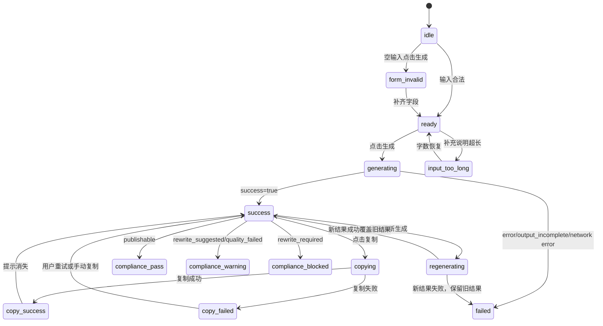

# 06_FE_Implementation_Plan.md

> 任务编号：FE-PREP-01  
> 任务名称：前端实现前技术拆解与组件任务清单  
> 角色：前端工程师  
> 当前阶段：正式前端编码前准备  
> 输出文件：`docs/features/moments/06_FE_Implementation_Plan.md`

---

## 1. 文档目的

本文档用于指导：

- 前端工程师实现“发朋友圈数字员工”页面。
- Codex 按小任务执行前端开发，不一次性乱改项目。
- QA 测试工程师编写前端交互、状态和回归测试用例。
- 产品负责人验收页面是否符合 MVP、PRD、UIUX 和技术方案。
- 架构师 / 全栈工程师复核页面入口、API 调用方式和文件修改边界。

本文档只做前端实现前技术拆解，不直接修改业务代码，不新增依赖，不接入真实微信，不修改 API、服务、模型、Prompt、`.env`、密钥、Token 或生产配置。

---

## 2. 输入文档读取结果

| 文档路径 | 是否读取 | 关键信息 | 是否存在冲突 |
|---|---|---|---|
| `docs/features/moments/01_MRD.md` | 是 | 目标是帮助跨境支付渠道商在 3 分钟内生成专业、合规、可复制到朋友圈的内容草稿；第一阶段不做全能工作台 | 无阻塞冲突 |
| `docs/features/moments/02_PRD.md` | 是 | 页面主流程：输入字段 → 生成 → 展示标题/正文/转发建议/合规提示/改写建议 → 复制/重新生成/反馈 | 与用户指令字段别名存在差异，见冲突点 |
| `docs/features/moments/03_UIUX.md` | 是 | Streamlit 页面应包含头部、输入表单、生成按钮、结果区、复制、重新生成、有用/没用；移动端单列 | 无阻塞冲突 |
| `docs/features/moments/03_UIUX_Wireframe.html` | 是 | 390px 移动端低保真原型，包含输入区、结果区、辅助信息、反馈区和状态说明 | 无阻塞冲突 |
| `docs/features/moments/03_UIUX_Wireframe_Spec.md` | 是 | 已将原型拆为组件、字段、状态、API、QA 测试点和未决问题 | 无阻塞冲突 |
| `docs/features/moments/04_AI_Design.md` | 是 | 输入校验、失败兜底、质量校验、敏感词、`input_empty` / `input_too_long` / `quality_failed` 状态明确 | 无阻塞冲突 |
| `docs/features/moments/05_Tech_Design.md` | 是 | 前端为 Streamlit；建议页面 `ui/pages/moments_employee.py`；生成接口 `POST /api/moments/generate`；响应含 `result.compliance_tip` | 无阻塞冲突 |
| `docs/features/moments/06_Tasks.md` | 是 | FE-01~FE-05 任务覆盖入口、表单、API、结果、反馈；要求不扩大 MVP | 无阻塞冲突 |

冲突点：

| 冲突点 | 说明 | 处理建议 |
|---|---|---|
| 字段命名 `selling_points` vs `product_points` | 用户本次指令要求覆盖 `selling_points`，但 PRD / Tech Design / 后端模型使用 `product_points` | 前端实现计划中可把 `selling_points` 作为 UI 别名，不进入 API；实际请求使用 `product_points` |
| 字段命名 `tone` vs `copy_style` | 用户本次指令要求覆盖 `tone`，但上游文档使用 `文案风格` / `copy_style` | 前端内部可用 `copyStyle`；如使用 `tone` 仅作为说明别名；API 使用 `copy_style` |
| 字段命名 `regenerate_from_id` vs `previous_generation_id` | 用户本次指令要求覆盖 `regenerate_from_id`，但技术方案使用 `previous_generation_id` | 前端状态可命名 `regenerateFromId`，请求映射到 `previous_generation_id` |
| 合规风险等级字段 | 指令提到 risk level，但 Tech Design 返回 `compliance_tip.status` 和 `risk_types` | MVP 由前端根据 `status` 派生风险等级，不要求后端新增字段 |

---

## 3. 当前前端项目结构分析

| 检查项 | 结论 |
|---|---|
| 项目根目录判断 | 当前根目录为 `/Users/macbookm4/Desktop/黑客松参赛项目` |
| 技术栈判断 | 前端为 Streamlit + Python；未发现 React / Vue / Next / Vite / TS 前端项目 |
| 启动方式判断 | Streamlit 前端可用 `streamlit run app.py`；FastAPI 可用 `uvicorn api.main:app --reload --port 8000`；`scripts/start_dev.sh` 存在但不是本功能前端实现的必改项 |
| 入口文件 | `app.py`，包含 `st.set_page_config`、全局 CSS、session_state 初始化和页面路由 |
| 页面目录 | `ui/pages/`，页面文件采用 snake_case，如 `content_factory.py`、`battle_station.py` |
| 组件目录 | `ui/components/`，包含 `sidebar.py`、`error_handlers.py`、`ui_cards.py` 等 |
| 样式目录 | `ui/styles/` 存在但当前主要样式注入在 `app.py` 的 `_inject_brand_css()` |
| API 请求封装位置 | 未发现统一前端 API client；当前页面多为直接调用本地 service / agent；`api/main.py` 提供 FastAPI 外部接口 |
| 是否已有类似功能页面 | `ui/pages/content_factory.py` 已有内容工厂和朋友圈/LinkedIn/邮件内容生成逻辑，可参考展示方式，但不应直接复用其业务流 |
| 可复用资产 | `ui.components.error_handlers.render_copy_button`、`render_empty_state`、`render_error`；`ui.components.ui_cards.render_info_card`、`render_status_badge` |
| 不建议修改的区域 | 不建议修改 `services/*`、`models/*`、`prompts/*`、现有 agent 页面业务逻辑、全局初始化逻辑、生产配置 |
| 测试结构 | `tests/test_ui_components.py` 使用 pytest + mock `streamlit` 的方式测试 UI helper；可新增 moments 相关 UI helper 测试 |
| 不确定信息 | sidebar 最终入口归属、Streamlit 页面是否通过 HTTP 调 FastAPI 或通过后续本地 wrapper 调 service、feedback API 完成时间、`rewrite_required` 与兜底模板复制策略仍需确认 |

真实结构检查摘要：

- 只发现 `requirements.txt`，未发现 `package.json`、`vite.config`、`next.config`、`tsconfig`。
- `api/` 当前只有 `api/main.py`，无 routes 目录。
- `ui/pages/` 是正式页面目录。
- `ui/components/` 是可复用 UI helper 目录。
- `assets/templates/` 有 HTML 模板，但本功能不复用该目录能力。

---

## 4. 页面入口方案

### 方案 A：复用现有页面入口

| 项目 | 内容 |
|---|---|
| 适用条件 | 希望把“发朋友圈数字员工”作为内容工厂内的一个 tab 或区块 |
| 需要修改的文件 | `ui/pages/content_factory.py` |
| 优点 | 用户路径接近“渠道商内容工厂”；减少 sidebar 入口变化 |
| 风险 | 容易与现有内容工厂的多场景、多内容类型逻辑混在一起，影响已有页面；不利于隔离状态和测试 |
| 是否推荐 | 不推荐作为第一实现方案 |

### 方案 B：新增独立页面入口

| 项目 | 内容 |
|---|---|
| 建议路由 | sidebar 中新增或挂到“市场专员”页面下的独立入口“发朋友圈数字员工”；页面函数 `render_moments_employee()` |
| 需要新增的文件 | `ui/pages/moments_employee.py` |
| 需要修改的文件 | `app.py` 页面路由小范围增加；`ui/components/sidebar.py` 小范围增加入口或映射 |
| 优点 | 状态、表单、API 接入和 QA 测试最清晰；不会污染现有内容工厂 |
| 风险 | 需要改 sidebar 和 app 路由；需确认入口归属是否放在一级导航还是“市场专员”页面内部 |
| 是否推荐 | 推荐 |

推荐方案：方案 B。

原因：`05_Tech_Design.md` 和 `06_Tasks.md` 均建议 `ui/pages/moments_employee.py`。独立页面最利于隔离 MVP 边界，避免影响现有内容工厂页面。

---

## 5. 页面结构拆解

| 区域 | 前端组件 | 输入数据来源 | 是否依赖 API | 状态依赖 | 渲染规则 | 验收标准 |
|---|---|---|---|---|---|---|
| 顶部标题区 | `render_moments_employee` 内标题区 | 固定文案 | 否 | 无 | 展示“发朋友圈数字员工”和返回/说明 | 标题可见，移动端不遮挡 |
| 功能说明区 | `MomentsStateMessage` 或页面说明 block | 固定文案 | 否 | `idle` | 简短说明功能，不放营销大段文字 | 首次进入能理解用途 |
| 输入表单区 | `MomentsForm` | `st.session_state.moments_form` | 否 | `idle`、`ready`、`form_invalid`、`input_too_long`、`generating` | 五个字段单列；生成中可禁用 | 字段完整，错误提示正确 |
| 生成按钮区 | `MomentsGenerateButton` | 表单校验结果 | 是 | `ready`、`generating`、`input_too_long` | 超长禁用；生成中 loading；失败后恢复 | 状态切换正确 |
| 状态提示区 | `MomentsStateMessage` | API 响应、校验结果、复制结果 | 部分依赖 | 全状态 | 靠近触发区域展示错误/加载/复制提示 | 每个状态有可见反馈 |
| 结果展示区 | `MomentsResultCard` | `response.result.title/body` | 是 | `success`、`failed`、`regenerating` | 正文为主内容；标题不默认复制；兜底要标识 | 五类输出展示完整 |
| 合规提示区 | `MomentsComplianceBadge` | `result.compliance_tip` | 是 | `compliance_pass/warning/blocked` | 靠近正文展示，不放底部 | 风险不被隐藏 |
| 操作按钮区 | `MomentsActionBar` | `currentResult`、`copyState` | 部分依赖 | `success`、`regenerating`、`copy_*` | 复制、重新生成、有用、没用 | 无结果不显示或禁用 |
| 底部说明区 | 静态说明 / `MomentsStateMessage` | 固定范围说明 | 否 | 无 | 只说明不做范围，不提供入口 | 不出现 MVP 外操作 |

---

## 6. 组件拆分方案

项目不是 React，以下“组件”应理解为 Streamlit 渲染函数或小型 helper 函数，命名保留职责清晰。

| 组件 | 职责 | Props | Events | 内部状态 | 依赖 API | 是否可复用 | 验收标准 |
|---|---|---|---|---|---|---|---|
| `MomentsPage` / `render_moments_employee` | 页面容器，串联表单、生成、结果、反馈 | 无；读取 session_state | 调用生成、复制、重新生成、反馈回调 | 是：`ui_state`、`form`、`current_result`、`previous_result` | 是 | 低 | 页面完整渲染，入口可进入 |
| `MomentsForm` / `render_moments_form` | 渲染五个输入字段与字段错误 | `form_value`、`field_errors`、`disabled` | `on_change` 通过 Streamlit widget key 实现 | 可使用 session_state | 否 | 中 | 字段选项与 PRD 一致，校验可触发 |
| `MomentsGenerateButton` / `render_generate_button` | 生成按钮状态 | `ui_state`、`is_valid` | `on_generate` | 否 | 是 | 中 | 超长禁用、生成中禁用、失败后可点击 |
| `MomentsStateMessage` / `render_state_message` | 空、加载、错误、复制状态提示 | `ui_state`、`message`、`field_errors` | 无 | 否 | 否 | 高 | 12 个状态均有文案 |
| `MomentsResultCard` / `render_result_card` | 展示标题和正文 | `result`、`fallback_used` | 无 | 否 | 否 | 中 | 正文醒目，兜底标识可见 |
| `MomentsComplianceBadge` / `render_compliance_badge` | 展示合规状态、风险和建议 | `compliance_tip` | 无 | 否 | 否 | 高 | 三类合规状态区分 |
| `MomentsActionBar` / `render_action_bar` | 复制、重新生成、有用、没用 | `has_result`、`copy_state`、`is_loading` | `on_copy`、`on_regenerate`、`on_feedback` | 可维护短暂 copy 状态 | 部分 | 中 | 复制仅正文，重新生成保留旧结果 |
| `MomentsFeedbackPanel` / `render_feedback_panel` | 展示负反馈原因和说明 | `visible`、`feedback_value` | `on_submit_feedback` | 是 | 后续依赖 feedback API | 中 | 没用后可展开，提交后提示已收到 |

---

## 7. 表单字段实现计划

| 字段 key | UI 名称 | 控件类型 | 必填 | 默认值 | 可选值 | 校验规则 | 错误提示 | API 映射 |
|---|---|---|---|---|---|---|---|---|
| `content_type` | 内容类型 | `st.selectbox` | 是 | 空 / 请选择 | 产品解读、热点借势、客户案例 | 必须选择预设项 | 请选择内容类型 | `content_type` |
| `target_customer` | 目标客户 | `st.selectbox` | 是 | 空 / 请选择 | 跨境电商卖家、货物贸易、服务贸易 | 必须选择预设项 | 请选择目标客户 | `target_customer` |
| `selling_points` | 产品卖点 | `st.multiselect` 或 checkbox 组 | 是 | 空列表 | 到账快、费率透明、合规安全 | 至少 1 项，最多 3 项 | 请至少选择 1 个产品卖点 | UI 别名，提交时映射到 `product_points` |
| `tone` | 文案风格 | `st.radio` | 是 | 专业 | 专业、轻松、销售感强 | 必须选择预设项 | 请选择文案风格 | UI 别名，提交时映射到 `copy_style` |
| `extra_context` | 补充说明 | `st.text_area` | 否 | 空字符串 | 自由输入 | 去除首尾空格，最多 300 字 | 补充说明最多 300 字 | `extra_context` |
| `regenerate_from_id` | 重新生成来源 ID | hidden session state | 否 | 空 | 当前 `generation_id` | 仅重新生成时存在 | 无需用户提示 | UI 别名，提交时映射到 `previous_generation_id` |

枚举映射：

| UI 文案 | API 值 |
|---|---|
| 产品解读 | `product_explain` |
| 热点借势 | `trend_jacking` |
| 客户案例 | `customer_case` |
| 跨境电商卖家 | `cross_border_ecommerce_seller` |
| 货物贸易 | `goods_trade` |
| 服务贸易 | `service_trade` |
| 到账快 | `fast_settlement` |
| 费率透明 | `transparent_fee` |
| 合规安全 | `compliance_safe` |
| 专业 | `professional` |
| 轻松 | `casual` |
| 销售感强 | `sales_driven` |

---

## 8. 前端状态机设计

| 状态 | 触发条件 | 页面表现 | 允许操作 | 禁用操作 | API 调用 | 退出条件 |
|---|---|---|---|---|---|---|
| `idle` | 首次进入或刷新 | 空状态，表单可编辑 | 填写表单、点击生成触发校验 | 复制、重新生成 | 否 | 输入合法进入 `ready`，空输入点击进入 `form_invalid` |
| `form_invalid` | 必填为空或卖点为空 | 字段错误 | 修改输入 | 复制、重新生成 | 否 | 字段合法后进入 `ready` |
| `ready` | 表单合法且未生成 | 表单可编辑，生成按钮可点 | 点击生成 | 复制、重新生成 | 点击生成时调用 | 点击生成进入 `generating` |
| `generating` | 首次生成请求中 | Loading，按钮禁用 | 等待 | 再次生成、复制、重新生成 | 是 | 成功进入 `success`，失败进入 `failed` |
| `success` | 返回 `success=true/status=success` | 展示结果和操作按钮 | 复制、重新生成、反馈 | 无 | 否 | 复制进入 copy 状态，重新生成进入 `regenerating` |
| `failed` | 网络失败或 `status=error/output_incomplete` | 失败提示或兜底模板 | 修改输入、重新生成 | 视兜底策略限制复制 | 否 | 重试进入 `generating` 或 `regenerating` |
| `copying` | 点击复制正文 | 可短暂展示复制中 | 等待 | 重复复制 | 否 | 成功进入 `copy_success`，失败进入 `copy_failed` |
| `copy_success` | 浏览器复制成功 | Toast “已复制” | 继续复制、重新生成 | 无 | 否 | 提示消失回到 `success` |
| `copy_failed` | 浏览器复制失败 | Toast “复制失败，请手动复制正文” | 手动选择正文、再次复制 | 无 | 否 | 用户关闭提示或再次复制 |
| `regenerating` | 有旧结果后点击重新生成 | 旧结果保留，显示正在生成新版本 | 等待 | 重复重新生成 | 是 | 新成功覆盖旧结果，失败保留旧结果并显示失败 |
| `input_too_long` | 补充说明超过 300 字 | 字数错误，生成按钮禁用 | 删除文本 | 生成 | 否 | 字数恢复后进入 `ready` 或 `idle` |
| `compliance_pass` | `compliance_tip.status=publishable` | 展示可发布参考 | 复制、重新生成、反馈 | 无 | 否 | 重新生成或修改输入 |
| `compliance_warning` | `compliance_tip.status=rewrite_suggested` 或质量风险可改写 | 高亮建议修改 | 复制、重新生成、反馈 | 无 | 否 | 重新生成或人工修改 |
| `compliance_blocked` | `compliance_tip.status=rewrite_required` | 高亮发布前必须修改 | 重新生成、反馈；复制策略待确认 | 复制是否禁用待确认 | 否 | 重新生成或人工修改 |



---

## 9. API 对接计划

| 项目 | 计划 |
|---|---|
| 请求方法 | `POST` |
| 请求路径 | `/api/moments/generate` |
| 是否需要新增 API client 文件 | 建议先在 `ui/pages/moments_employee.py` 内封装 `_call_generate_api()`，正式复用需求出现后再抽 `ui/api_client.py`；避免过早抽象 |
| 请求参数 | `content_type`、`target_customer`、`product_points`、`copy_style`、`extra_context`、`session_id`、`previous_generation_id` |
| 成功响应结构 | `success=true`、`status=success`、`generation_id`、`result`、`quality`、`errors=[]`、`fallback_used=false`、`created_at` |
| 失败响应结构 | `success=false`、`status`、`errors[]`、可选 `result`、`fallback_used` |
| request_id 处理方式 | 当前 Tech Design 返回 `generation_id`，未定义 `request_id`；前端使用 `generation_id` 作为请求结果 ID |
| loading 处理方式 | 点击生成后设置 `ui_state=generating`；重新生成时设置 `ui_state=regenerating` |
| error.code 映射 | `input_empty` 映射字段错误；`input_too_long` 映射字数错误；`invalid_option` 映射字段/顶部错误；`ai_timeout` / `ai_empty_output` / `output_incomplete` 映射失败或兜底提示；`quality_failed` 映射合规风险 |
| compliance.status 映射 | `publishable` → `compliance_pass`；`rewrite_suggested` → `compliance_warning`；`rewrite_required` → `compliance_blocked` |
| AI 生成失败反馈 | 展示“生成失败，请稍后重试，或修改输入后重新生成”；若返回兜底模板，必须显示“需要人工补充” |
| AI 输出格式异常反馈 | 展示 `output_incomplete`，显示兜底模板和人工补充提示 |

请求 payload 示例：

```json
{
  "content_type": "product_explain",
  "target_customer": "cross_border_ecommerce_seller",
  "product_points": ["fast_settlement", "compliance_safe"],
  "copy_style": "professional",
  "extra_context": "",
  "session_id": "streamlit_session",
  "previous_generation_id": "mom_20260424_0001"
}
```

---

## 10. 复制功能实现计划

| 项目 | 计划 |
|---|---|
| 复制内容范围 | 仅复制 `result.body`，不复制标题、转发建议、合规提示、改写建议 |
| 浏览器 API | 优先复用 `ui.components.error_handlers.render_copy_button()` 的 `navigator.clipboard.writeText()` 方案 |
| 成功提示 | 按钮短暂显示“已复制”，或 Streamlit Toast / success 提示 |
| 失败提示 | “复制失败，请手动选择正文复制” |
| 失败降级 | 正文保持可见且可手动选中；必要时提供 `st.text_area` 只读展示正文 |
| 移动端兼容风险 | WebView / 浏览器权限可能导致 clipboard 失败；必须保留手动复制路径 |
| `rewrite_required` 下是否允许复制 | 未决问题；默认建议可复制但强提示“不建议直接发布”，最终由产品负责人 / 合规负责人确认 |
| `compliance_blocked` 下是否允许复制 | 与 `rewrite_required` 同一问题；前端实现时应保留可配置判断，不写死最终策略 |
| 兜底模板是否允许复制 | 未决问题；默认展示兜底模板并标注“需要人工补充”，复制策略由产品负责人 / 合规负责人确认 |

---

## 11. 重新生成实现计划

| 项目 | 计划 |
|---|---|
| 原始输入 | 复用当前表单输入，不从旧结果反推 |
| 是否传 `regenerate_from_id` | 前端状态可保存 `regenerate_from_id=current_generation_id`，请求时映射到 `previous_generation_id` |
| 重新生成中展示 | 保留旧结果，在状态提示区显示“正在生成新版本，上一版结果会先保留” |
| 失败后是否保留旧结果 | 是，符合 PRD / UIUX |
| 新结果如何替换旧结果 | API 成功后将 `current_result` 替换为新 `result`，`previous_result` 可仅用于本次展示，不做历史列表 |
| 是否记录 request_id | 当前记录 `generation_id`；无独立 `request_id` |

---

## 12. 合规提示展示计划

| compliance.status | UI 表现 | 操作限制 | 提示文案 | QA 验收点 |
|---|---|---|---|---|
| `publishable` | 低风险状态，展示“可发布参考” | 复制、重新生成、反馈可用 | 当前内容可作为发布前参考，请结合真实业务场景人工确认。 | 状态可见；不包装成法律意见 |
| `rewrite_suggested` | 中风险状态，黄色/警示样式，展示风险项和改写建议 | 复制可用，但风险提示必须靠近正文 | 当前内容存在需注意的表达，建议根据改写建议调整后再发布。 | 风险项和改写建议可见 |
| `rewrite_required` | 高风险状态，红色/强警示样式，展示“发布前必须修改” | 复制按钮是否可用待产品确认；重新生成可用 | 当前内容存在高风险表达，请修改后再发布。 | 不建议直接发布的提示醒目，不能隐藏 |

注意：合规提示只作为基础风险提示，不得包装成法律意见、正式审核结论或自动发布许可。

---

## 13. 负反馈功能处理建议

| 项目 | 结论 |
|---|---|
| 是否要求实现 | PRD / UIUX / Tech Design 均要求有用 / 没用反馈；属于 MVP 范围 |
| 是否本阶段必须做 | FE-05 阶段实现；不阻塞 FE-01~FE-04 主生成链路 |
| UI 位置 | 结果操作区下方；点击“没用”后展开负反馈原因和可选说明 |
| 反馈原因枚举 | 建议沿用 Tech Design：`too_generic`、`too_salesy`、`not_professional`、`compliance_concern`、`style_mismatch`、`other` |
| 是否需要 API | 需要 `POST /api/moments/feedback`；若 BE-03 未完成，可先禁用提交或 Mock 提示 |
| 是否阻塞前端开发 | 不阻塞 FE-01~FE-04；阻塞 FE-05 完整反馈验收 |
| 如何降级处理 | 若反馈 API 未完成，保留“有用 / 没用”展示；点击后提示“反馈能力开发中”或仅本地记录，不影响生成、复制、重新生成主链路 |

---

## 14. 页面刷新与结果恢复策略

| 策略 | 判断 |
|---|---|
| 刷新后清空页面 | 推荐本期默认策略 |
| 刷新后恢复上一条结果 | 不推荐作为 MVP 必做；PRD 明确历史记录区本期不做 |
| 使用 localStorage | 不建议；Streamlit 项目中会增加额外前端脚本复杂度 |
| 使用后端记录查询 | 后端可有调试查询接口，但前端不做历史列表和恢复 |

理由：

- `02_PRD.md` 明确历史记录区本期不做。
- `03_UIUX_Wireframe_Spec.md` 建议刷新后回到初始状态。
- 恢复历史结果会引入记录查询、状态恢复和隐私边界，超出当前主链路。

风险：

- 用户刷新后会丢失当前结果；可通过后续版本的生成记录能力解决。

---

## 15. 文件修改计划

| 文件路径 | 新增/修改 | 修改目的 | 风险等级 | 是否需要测试 | 对应任务 |
|---|---|---|---|---|---|
| `ui/pages/moments_employee.py` | 新增 | 实现页面容器、表单、状态、结果、操作区 | 中 | 是 | FE-01~FE-09 |
| `app.py` | 修改 | 注册 moments 页面路由 | 中 | 是 | FE-01 |
| `ui/components/sidebar.py` | 修改 | 增加页面入口或导航映射 | 中 | 是 | FE-01 |
| `tests/test_ui_components.py` | 修改或新增测试 | 增加 helper 函数或状态映射测试 | 低 | 是 | FE-02~FE-10 |
| `tests/test_moments_ui.py` | 新增 | 单独测试 moments 前端状态 helper / API payload 映射 | 低 | 是 | FE-03~FE-10 |
| `docs/features/moments/07_Test_Cases.md` | 可选新增 | QA 正式测试用例归档 | 低 | 否 | QA 后续 |

不建议修改：

- `api/main.py`：FE 阶段不改 API。
- `services/*`：FE 阶段不改 service。
- `models/*`：FE 阶段不改模型。
- `prompts/*`：FE 阶段不改 Prompt。
- `.env` / `.streamlit/secrets.toml` / 生产配置：禁止修改。

---

## 16. 前端开发任务拆分

| 任务编号 | 任务目标 | 修改范围 | 输入文档 | 具体步骤 | 验收标准 | 风险 | 不允许做的事 |
|---|---|---|---|---|---|---|---|
| FE-01 页面入口与路由 | 新增 moments 页面文件并接入 Streamlit 入口 | `ui/pages/moments_employee.py`、`app.py`、`ui/components/sidebar.py` | `03_UIUX.md`、`03_UIUX_Wireframe.html`、本计划 | 新建 `render_moments_employee()`；在 sidebar 增加入口；在 app 路由导入并调用 | 页面可进入；标题和基础区块可见；旧页面入口不受影响 | sidebar 一级导航是否过多，入口归属待产品确认 | 不实现生成 API、不改 service、不重构导航 |
| FE-02 表单组件 | 实现五个输入字段 | `ui/pages/moments_employee.py` | `02_PRD.md`、`03_UIUX.md`、本计划 | 添加 selectbox、multiselect/radio/text_area；建立 UI 文案到 API 值映射 | 字段完整，默认值正确，选项与 PRD 一致 | `selling_points/tone` 别名与 API 字段混淆 | 不新增 PRD 外字段 |
| FE-03 状态机与校验 | 实现前端状态和表单校验 | `ui/pages/moments_employee.py`、可选 `tests/test_moments_ui.py` | `03_UIUX_Wireframe_Spec.md`、`04_AI_Design.md` | 初始化 session_state；实现 required、1~3 卖点、300 字校验；状态切换 | 空输入、超长输入、ready/generating 状态正确 | Streamlit rerun 导致状态丢失 | 不只依赖前端校验，后端仍需校验 |
| FE-04 API 请求封装 | 接入 `POST /api/moments/generate` | `ui/pages/moments_employee.py` | `05_Tech_Design.md`、`06_Tasks.md` | 封装 `_build_generate_payload()` 和 `_call_generate_api()`；处理 success=false、超时、返回格式异常 | Mock success/error/empty/sensitive 可返回并驱动状态；API 超时和 AI 输出格式异常有提示 | 本地 FastAPI 未启动时网络失败；HTTP 调用方式待架构师复核 | 不在页面层直接调用 LLM；不修改 API |
| FE-05 结果卡片 | 展示标题、正文、转发建议、改写建议 | `ui/pages/moments_employee.py` | `03_UIUX_Wireframe.html`、`03_UIUX_Wireframe_Spec.md` | 渲染 result card；正文单独主展示；兜底标识 | 五类输出完整可见；正文为默认复制内容 | 兜底模板被误认为最终可发布 | 不复制辅助信息 |
| FE-06 合规提示 | 展示 publishable / rewrite_suggested / rewrite_required | `ui/pages/moments_employee.py` | `04_AI_Design.md`、`03_UIUX_Wireframe_Spec.md` | 派生合规状态；展示风险项、message、rewrite_suggestion | 三种状态样式和文案区分；风险提示靠近正文 | 复制按钮在 blocked 状态策略未定 | 不把合规提示写成法律意见 |
| FE-07 复制功能 | 复制正文并处理成功/失败提示 | `ui/pages/moments_employee.py`，可复用 `ui/components/error_handlers.py` | `03_UIUX.md`、本计划 | 只复制 `result.body`；成功显示“已复制”；失败保留手动复制；保留 blocked/fallback 策略开关 | 不复制标题/辅助信息；移动端失败有降级 | Clipboard API 兼容性；兜底模板复制策略未定 | 不接入微信分享或发布 |
| FE-08 重新生成 | 支持保留旧结果并重新生成 | `ui/pages/moments_employee.py` | `02_PRD.md`、`03_UIUX.md` | 点击重新生成时传 `previous_generation_id`；旧结果保留；新成功覆盖 | 新结果失败时旧结果仍可见 | session_state 管理复杂 | 不做历史列表 |
| FE-09 异常状态 | 完整处理 error/output_incomplete/quality_failed/copy_failed | `ui/pages/moments_employee.py` | `04_AI_Design.md`、`05_Tech_Design.md` | 解析 `status` 和 `errors[]`；展示兜底、风险、API 超时、AI 输出格式异常和重试提示 | Mock error/empty/sensitive、超时、格式异常均能正确展示 | 错误文案过泛导致 QA 难判断 | 不吞掉错误状态 |
| FE-10 前端自测 | 完成 Streamlit 手动自测和 helper 单测 | `tests/test_moments_ui.py`、测试记录 | 本计划、`03_UIUX_Wireframe_Spec.md` | 覆盖表单映射、状态派生、Mock 场景、API 超时、输出格式异常手动验证 | 指定测试通过；手动主流程通过；不做范围入口不存在 | Streamlit 端到端自动化不足 | 不为测试弱化业务逻辑 |

---

## 17. QA 测试映射

| 测试编号 | 场景 | 前置条件 | 操作步骤 | 预期结果 | 对应状态 | 是否阻塞上线 |
|---|---|---|---|---|---|---|
| FE-QA-001 | 初始空状态 | 打开页面 | 进入 moments 页面 | 标题、输入区、空状态可见 | `idle` | 是 |
| FE-QA-002 | 表单为空 | 必填字段为空 | 点击生成 | 字段错误展示，不调用 API | `form_invalid` | 是 |
| FE-QA-003 | 输入合法但未生成 | 填完整合法字段 | 不点击生成 | 生成按钮可点击，无结果 | `ready` | 否 |
| FE-QA-004 | 生成中 | 合法输入 | 点击生成 | Loading，按钮禁用 | `generating` | 是 |
| FE-QA-005 | 生成成功 | Mock success | 点击生成 | 五类输出完整展示 | `success` / `compliance_pass` | 是 |
| FE-QA-006 | 生成失败 | Mock error | 点击生成 | 失败提示和兜底标记可见 | `failed` | 是 |
| FE-QA-007 | 复制成功 | 已有成功结果 | 点击复制文案 | 只复制正文，提示已复制 | `copy_success` | 是 |
| FE-QA-008 | 复制失败 | 模拟 clipboard 失败 | 点击复制文案 | 提示手动复制，正文保留 | `copy_failed` | 是 |
| FE-QA-009 | 重新生成中 | 已有成功结果 | 点击重新生成 | 旧结果保留，显示正在生成新版本 | `regenerating` | 是 |
| FE-QA-010 | 重新生成成功 | 已有结果，Mock success | 点击重新生成 | 新结果覆盖旧结果 | `success` | 是 |
| FE-QA-011 | 重新生成失败 | 已有结果，Mock error | 点击重新生成 | 旧结果保留，展示失败提示 | `regenerating` / `failed` | 是 |
| FE-QA-012 | 超长输入 | 补充说明 301 字 | 查看按钮状态 | 显示字数错误，生成按钮禁用 | `input_too_long` | 是 |
| FE-QA-013 | 合规可发布 | Mock success | 生成 | 展示可发布参考 | `compliance_pass` | 是 |
| FE-QA-014 | 合规建议修改 | Mock 返回 rewrite_suggested 或 quality risk | 生成 | 高亮建议修改和改写建议 | `compliance_warning` | 是 |
| FE-QA-015 | 合规禁止发布 | Mock sensitive | 生成 | 高风险提示可见，不包装成法律意见 | `compliance_blocked` | 是 |
| FE-QA-016 | 兜底模板 | Mock empty | 生成 | “需要人工补充”标记可见 | `failed` | 是 |
| FE-QA-017 | MVP 边界 | 页面加载完成 | 检查按钮/导航 | 无本期不做范围入口 | 全状态 | 是 |
| FE-QA-018 | 移动端布局 | 390px 或窄屏 | 查看页面 | 单列、按钮不低于 44px、内容不重叠 | 全状态 | 否 |
| FE-QA-019 | 负反馈提交 | 已有成功结果 | 点击“没用”并选择原因 | 原因可选择；若 API 未完成则明确降级提示 | `success` | 否 |
| FE-QA-020 | API 超时 | 模拟 `/api/moments/generate` 超时 | 点击生成 | 展示超时/稍后重试提示，生成按钮恢复可点击 | `failed` | 是 |
| FE-QA-021 | AI 输出格式异常 | Mock 返回非预期结构或缺字段 | 点击生成 | 展示 `output_incomplete` / 兜底模板，不误判为可发布结果 | `failed` | 是 |

---

## 18. 风险与未决问题

| 未决问题 | 影响范围 | 是否阻塞开发 | 建议默认策略 | 需要谁决策 | 是否需要更新文档 |
|---|---|---|---|---|---|
| `rewrite_required` 下复制按钮是否可用 | 合规禁止发布、复制按钮 | 不阻塞 FE-01~FE-06；阻塞最终交互验收 | 默认按钮可用但强化“不建议直接发布”；最终确认前实现为可配置逻辑 | 产品负责人、合规负责人 | 是，补 PRD / UIUX 或任务卡 |
| 负反馈原因枚举 | Feedback panel、BE-03 对接 | 不阻塞 FE-01~FE-04；阻塞 FE-05 | 沿用 Tech Design 枚举 | 产品负责人 | 是，补 PRD / Tasks |
| 页面刷新后是否恢复上一条结果 | 状态恢复、历史记录 | 不阻塞 | 默认刷新后清空，回到 `idle` | 产品负责人、架构师 | 是，写入 FE 任务验收 |
| 合规风险等级是否前端派生 | 合规 Badge 展示 | 不阻塞 | 前端按 `compliance_tip.status` 派生 | 架构师 / 全栈工程师 | 是，补 Tech Design 后续说明 |
| 兜底模板是否允许复制 | error/output_incomplete 复制策略 | 不阻塞基础开发；阻塞最终复制策略 | 默认展示兜底且强标识；复制按钮策略待确认 | 产品负责人、合规负责人 | 是，补 PRD / UIUX |
| API client 放页面内还是抽公共模块 | 文件结构 | 不阻塞 | MVP 先页面内封装，复用需求出现再抽离 | 前端工程师、架构师 | 可写入任务卡 |
| sidebar 入口归属 | 导航体验 | 不阻塞页面开发，阻塞入口最终位置 | 推荐新增独立入口，必要时挂在市场专员下 | 产品负责人 | 是，补 FE-01 任务卡 |

---

## 19. 本期不做范围

本期前端不做：

- 自动发布微信。
- 定时发布。
- 审批流。
- 多账号。
- CRM。
- 素材库。
- 数据分析。
- 海报生成。
- 配图生成。
- 短视频脚本。
- 真实微信授权。
- 渠道商门户。
- 大规模重构。
- 引入新 UI 框架。
- 接入外部 CDN。
- 修改生产配置。

这些内容不得作为按钮、导航、入口、tab、主流程操作或隐藏功能实现。

---

## 20. 建议进入正式开发的条件

进入正式前端开发前建议满足：

- 文档读取完整：本计划已读取全部指定上游文档。
- 页面入口方案确定：推荐 `ui/pages/moments_employee.py` 独立页面，sidebar/app 小范围接入。
- API 字段映射确定：UI 别名与 API 字段映射已明确。
- 状态机确定：14 个前端状态和状态流转已明确。
- 未决问题不阻塞：已逐项判断，均不阻塞 FE-PREP 后进入 FE-01。
- 文件修改范围明确：已限定后续 FE 文件范围，不改 service/model/prompt/API。
- QA 测试点明确：已列出 21 个前端测试点。
- 不做范围明确：本期不提供 MVP 外功能入口。
- 不需要新增外部依赖：沿用 Streamlit、现有 Python 依赖和本地组件。

---

## 21. 结论

是否建议进入前端开发：建议进入。

建议先执行：`FE-01 页面入口与路由`。

是否需要产品负责人补充决策：需要，但不阻塞 FE-01。需要确认 sidebar 入口位置、`rewrite_required` 和兜底模板复制策略。

是否需要架构师复核：建议复核 API 调用方式，尤其是 Streamlit 页面调用 FastAPI 还是后续使用本地 service wrapper。

是否需要 QA 提前准备测试用例：需要。QA 可基于第 17 节生成 `docs/features/moments/07_Test_Cases.md`。

实施纪律：

- 不一次性实现 FE-01~FE-10。
- 每次只给 Codex 一个任务编号。
- 每个任务必须限制文件范围。
- 不使用 `git add .`。
- 不自动 commit。
- 不修改 `.env`、密钥、Token、生产配置。
- 不扩大 MVP 范围。
